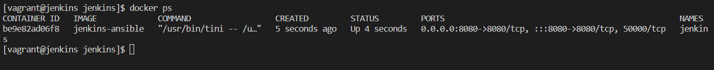

# Setup Ansible Service

### Install Ansible

`cd jenkins` directory on host machine.

Create a new directory `mkdir jenkins-ansible`.

Create a new [Dockerfile](/scripts/jenkins-ansible/Dockerfile) in the `jenkins-ansible` directory.

### Modify docker-compose file

Create a new `image: jenkins-ansible` in the exisiting [docker-compose](/scripts/docker-compose.yml) file.

Run `docker-compose build` on host machine.

Recreate the new jenkins service with the docker-compose file using the command `docker-compose up -d`.

### Verification

To verify ansible installation, enter the jenkins container, using `docker exec -ti jenkins bash`.

Create a directory `jenkins_home/ansible` in the jenkins container home directory.

Enter the command `ansible --version`:

