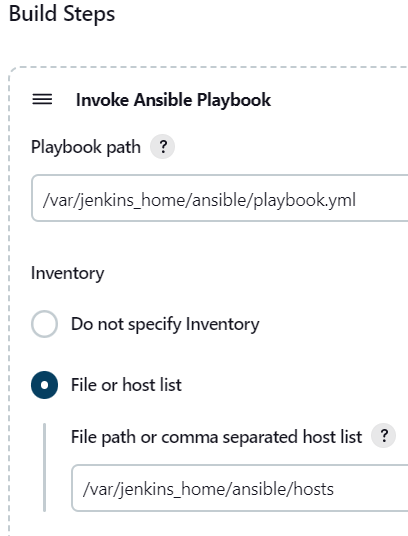

# Jenkins and Ansible Playbook

### Integrate Ansible with Jenkins

Create an ansible [playbook](/scripts/jenkins-ansible/playbook.yml) in the `jenkins-ansible` directory

Copy playbook to the ansible directory in the jenkins container
```
cp playbook.yml ../jenkins_home/ansible
```

#### Test Integration
To test the jenkins and ansible integration, execute the ansible playbook using a jenkins job

Before we can install the ansible plugin we need to perform the following tasks:

- Download `wget` utility on the host machine.
```
sudo yum install wget -y
```
Note:
Since security is not a core concern in this project, we need to install the ansible plugin on jenkins
with the `--no-check-certificate` flag.

Don't do this on servers exposed public. As this is pertained to local box experimentation!

- Enter the `jenkins_home` directory on host machine, navigate to `plugins` directory, download the ansible plugin
using `wget`.

```
wget https://updates.jenkins.io/download/plugins/ansible/1.1/ansible.hpi --no-check-certificate
```
Restart your jenkins-ansible service

```
docker-compose restart jenkins
```
Log into the Jenkins dashboard. Start a new freestyle project, under build step invoke an ansible playbook.

Configure the playbook path and inventory accordingly:




Build the ansible playbook job


#### Verify integration

Log into the remote host container and check for the `/tmp/ansible-file` created by the jenkins job


